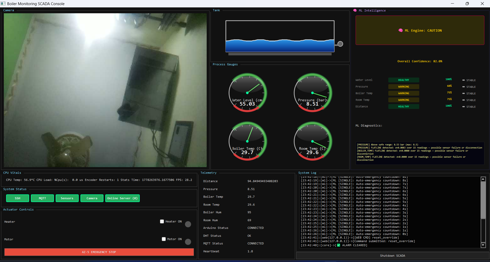
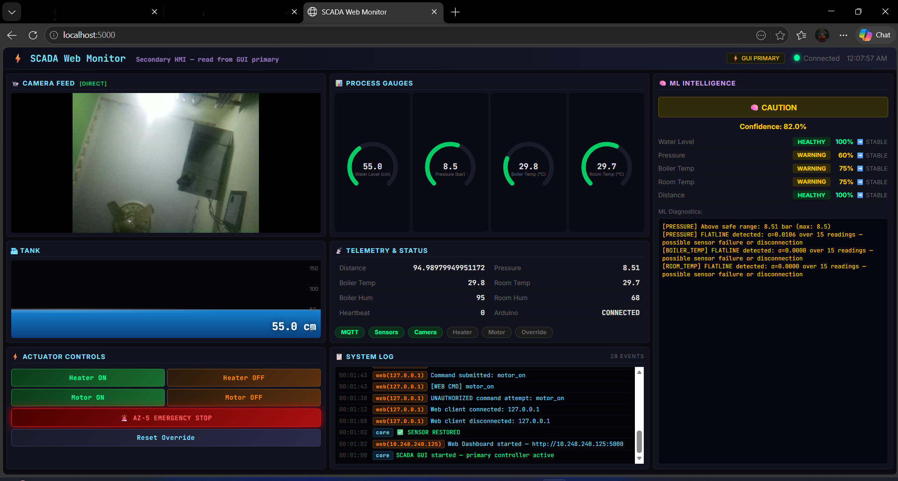
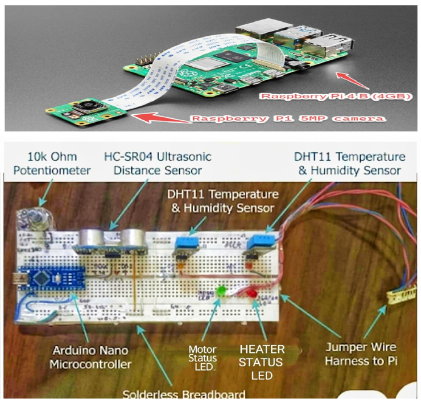
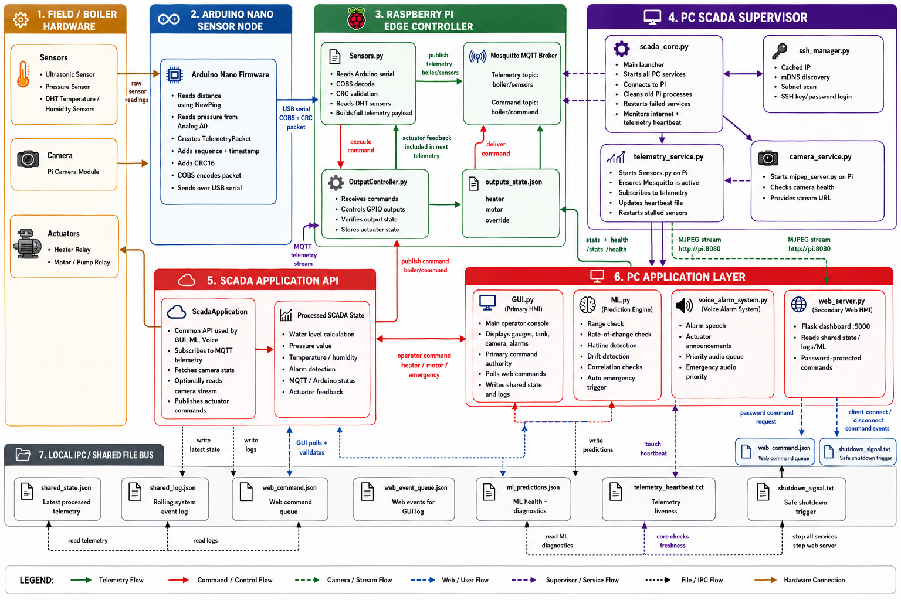
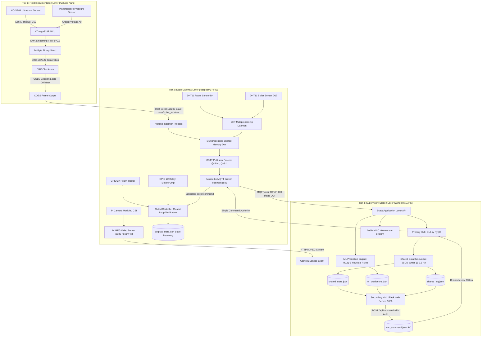
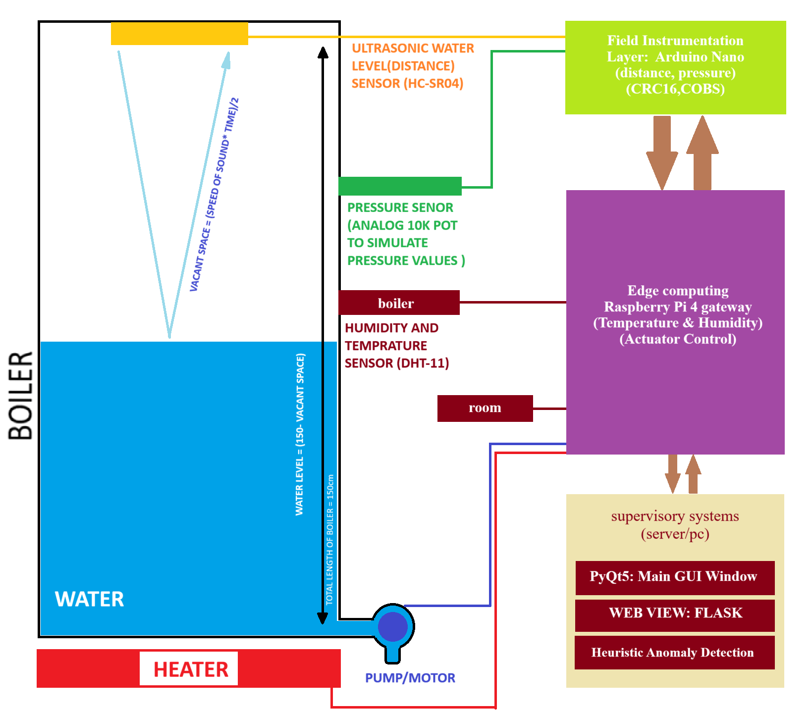
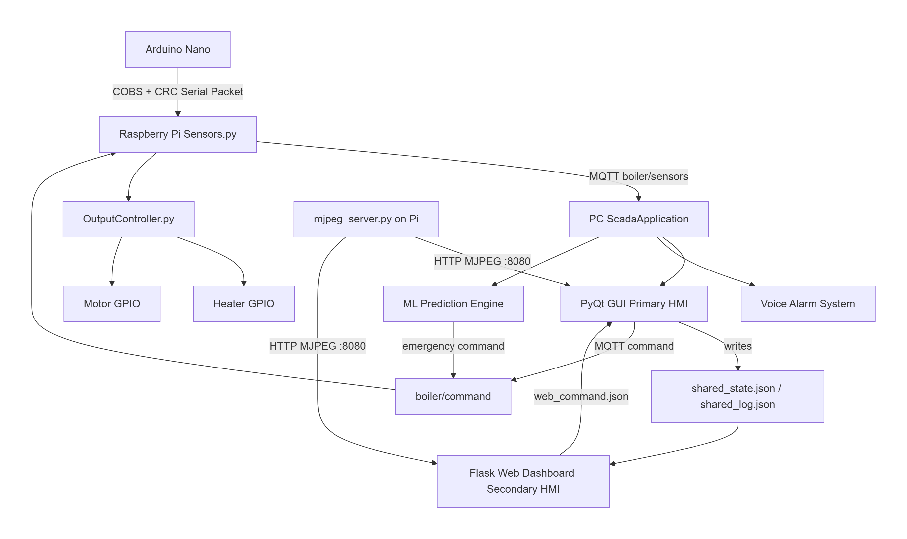

# Real-Time IoT-SCADA Framework for Industrial Boiler Monitoring, Anomaly Detection & Emergency Response

[](https://www.python.org/downloads/)
[](LICENSE)
[](#)
[](#)
[](#)
[](#)
[](#)
[](#)
[](https://www.msrit.edu)
[](#)

> **IoT-SCADA Mini Project** | **Project ID: 002/2026** | **Year of Project: 2026**  
> **Author**: **M NANDISH** (USN: `1MS23ET073`), Department of Electronics & Telecommunication Engineering, Ramaiah Institute of Technology (MSRIT), Bengaluru, Karnataka, India.  
> An industrial-grade, three-tier IoT-integrated Supervisory Control and Data Acquisition (SCADA) system engineered for real-time boiler process monitoring, multi-heuristic anomaly detection, prioritized voice enunciations, and autonomous failsafe emergency response. Fuses field-level embedded sensing (Arduino Nano), edge computing & MQTT brokering (Raspberry Pi 4B), and supervisory analytics (Windows 11 PC) with deterministic COBS+CRC16 serial framing, sub-400 ms closed-loop latency, and tiered autonomous shutdown protocols.

---

> [!IMPORTANT]
> **Laboratory Test Bench Simulation & Image Disclaimer**:  
> All camera feeds, animated tank widgets, and process gauge visualizations depicted in the dashboards and demonstration videos correspond to a **controlled bench-scale experimental test rig** (comprising a cylindrical water reservoir, submersible feed pump, heating element, and atmospheric test vessel) operated for academic evaluation. They do **not** represent a live, high-pressure commercial boiler installation. The bench prototype safely simulates pressure dynamics, fluid level kinematics, telemetry serialization, and emergency shutdown interlocks in a laboratory setting.

---

## 📸 Visual Showcase & System Dashboards (Live Bench Operations)

Experience the visual interfaces, live laboratory testbed, and emergency response screens powering the IoT-SCADA framework:

### 1. Primary Workstation & Remote Mobile Dashboards
| Primary Desktop SCADA Console (PyQt5) | Secondary Remote Web Dashboard (Flask) |
| :---: | :---: |
|  |  |
| *Full-screen supervisory workstation console featuring live MJPEG camera feed from the test rig, animated fluid reservoir, four circular process gauges, ML confidence panel, and rolling system event log.* | *Zero-install, mobile-responsive browser HMI operating on port 5000, displaying real-time SVG arc gauges, status cards, and PIN-authenticated actuator controls.* |

### 2. Physical Hardware Testbed & Automated Emergency Failsafe Screen
| Physical Laboratory Bench Rig | Automated Emergency Trip (AZ-5 Screen) |
| :---: | :---: |
|  |  |
| *Experimental laboratory setup: Arduino Nano field MCU, Raspberry Pi 4B edge gateway, HC-SR04 ultrasonic sensor, piezoresistive pressure transducer, and dual optocoupled relay modules.* | *Full-screen system emergency trip engaged when the autonomous countdown expires unacknowledged, showing actuator de-energization and locked status.* |

---

## 🎥 Video Demonstrations & Live Action Footage

Recorded live demonstration videos showcase the system's operational phases, voice alarming, and autonomous failsafe trip capabilities:

| Demonstration Video | Operational Phase & Core Highlights | Direct Media Link |
| :--- | :--- | :---: |
| **Complete System Demonstration** | Cold bootstrap, sensor ingestion, live PyQt5 gauge deflection, ultrasonic tank filling, video streaming, and remote command routing | [▶️ Watch BOILER_MNGT_SYS.mp4](Images_Videos/BOILER_MNGT_SYS.mp4) |
| **Alarm Sequence: Part 1** | High-pressure threshold breach detection, visual indicator transitions, and Priority 1 Audio NVIC voice alarm enunciation | [▶️ Watch Alarm_PART-1.mp4](Images_Videos/Alarm_PART-1.mp4) |
| **Alarm Sequence: Part 2 (AZ-5 Trip)** | Two-tier countdown activation, unacknowledged timer expiration, and autonomous emergency relay trip with hardware lock | [▶️ Watch Alarm_PART-2.mp4](Images_Videos/Alarm_PART-2.mp4) |

```
Local Video File Locations:
- Complete System Demo : Images_Videos/BOILER_MNGT_SYS.mp4
- Alarm Phase 1 Demo    : Images_Videos/Alarm_PART-1.mp4
- Emergency Trip Demo   : Images_Videos/Alarm_PART-2.mp4
```

---

## 🏗 Three-Tier System Architecture & High-Level Block Diagram

Before exploring the individual flowcharts and algorithms, the high-level block diagram below illustrates the physical and functional architecture of the three tiers:





### Architectural Tier Breakdown
- **Tier 1 (Field Instrumentation Layer)**: Powered by an ATmega328P microcontroller running at 16 MHz with hardware watchdog supervision (`WDTO_2S`). Interfaces the ultrasonic water level sensor and analog piezoresistive pressure transducer, applies digital smoothing, packages readings into a 14-byte binary struct, and transmits COBS-encoded frames with CRC-16 over USB serial at 115,200 baud.
- **Tier 2 (Edge Gateway Layer)**: Powered by a Raspberry Pi 4 Model B running Raspberry Pi OS Bullseye. Runs an isolated Python multiprocessing pipeline (`Sensors.py`) for serial ingestion, DHT11 environmental sampling, and MQTT publishing to `boiler/sensors` (5 Hz, QoS 1). Hosts the local Eclipse Mosquitto broker, native MJPEG camera server (`mjpeg_server.py`), and closed-loop actuator controllers (`OutputController.py`).
- **Tier 3 (Supervisory Station Layer)**: Hosted on a Windows 11 PC running Python 3.11. Coordinates six concurrent services through `scada_core.py`: the PyQt5 Primary Desktop HMI (`GUI.py`), the secondary Flask Web Dashboard (`web_server.py`), the 5-algorithm Anomaly Prediction Engine (`ML.py`), the Audio NVIC Voice Enunciator (`voice_alarm_system.py`), and atomic JSON inter-process communication buses.

---

## 📌 Table of Contents
- [Real-Time IoT-SCADA Framework for Industrial Boiler Monitoring, Anomaly Detection \& Emergency Response](#real-time-iot-scada-framework-for-industrial-boiler-monitoring-anomaly-detection--emergency-response)
  - [📸 Visual Showcase \& System Dashboards (Live Bench Operations)](#-visual-showcase--system-dashboards-live-bench-operations)
    - [1. Primary Workstation \& Remote Mobile Dashboards](#1-primary-workstation--remote-mobile-dashboards)
    - [2. Physical Hardware Testbed \& Automated Emergency Failsafe Screen](#2-physical-hardware-testbed--automated-emergency-failsafe-screen)
  - [🎥 Video Demonstrations \& Live Action Footage](#-video-demonstrations--live-action-footage)
  - [🏗 Three-Tier System Architecture \& High-Level Block Diagram](#-three-tier-system-architecture--high-level-block-diagram)
    - [Architectural Tier Breakdown](#architectural-tier-breakdown)
  - [📌 Table of Contents](#-table-of-contents)
  - [📊 Methodology \& Subsystem Flowchart Gallery](#-methodology--subsystem-flowchart-gallery)
    - [Engineering Methodology Flowchart](#engineering-methodology-flowchart)
    - [Modular Subsystem Flowcharts \& Architectural Diagrams](#modular-subsystem-flowcharts--architectural-diagrams)
  - [💡 Core Advantages of the Proposed Architecture](#-core-advantages-of-the-proposed-architecture)
  - [🔍 System Assumptions \& Environmental Boundary Conditions](#-system-assumptions--environmental-boundary-conditions)
  - [🚀 Scalability Architecture \& Multi-Unit Fleet Expansion](#-scalability-architecture--multi-unit-fleet-expansion)
  - [🧩 System Modularity \& Decoupled Component Design](#-system-modularity--decoupled-component-design)
  - [🔭 Project Overview \& Industrial Motivation](#-project-overview--industrial-motivation)
  - [📐 Theoretical Formulation \& Mathematical Foundations](#-theoretical-formulation--mathematical-foundations)
    - [1. Ultrasonic Time-of-Flight \& Liquid Kinematics](#1-ultrasonic-time-of-flight--liquid-kinematics)
    - [2. Piezoresistive Pressure Transduction \& Transfer Function](#2-piezoresistive-pressure-transduction--transfer-function)
    - [3. Consistent Overhead Byte Stuffing (COBS) Wire-Framing](#3-consistent-overhead-byte-stuffing-cobs-wire-framing)
    - [4. Telemetry Integrity Verification via Cyclic Redundancy Check (CRC-16/ANSI)](#4-telemetry-integrity-verification-via-cyclic-redundancy-check-crc-16ansi)
    - [5. Rule-Based Multi-Heuristic Anomaly Detection Engine (5 Algorithms)](#5-rule-based-multi-heuristic-anomaly-detection-engine-5-algorithms)
    - [6. Heuristic Confidence Aggregation \& Composite Plant Health Index](#6-heuristic-confidence-aggregation--composite-plant-health-index)
    - [7. Tiered Finite State Emergency Response Protocol (AZ-5 Trip)](#7-tiered-finite-state-emergency-response-protocol-az-5-trip)
    - [8. Audio NVIC Priority Dispatch Controller](#8-audio-nvic-priority-dispatch-controller)
  - [🔄 System Evolution: Legacy Prototype vs Modern Production SCADA](#-system-evolution-legacy-prototype-vs-modern-production-scada)
    - [Comparative Analysis: V1 vs V2.1 vs V2.2 vs V2.0 Production](#comparative-analysis-v1-vs-v21-vs-v22-vs-v20-production)
    - [Visual UI Evolution Showcase](#visual-ui-evolution-showcase)
  - [📂 Repository Structure \& Comprehensive File Map](#-repository-structure--comprehensive-file-map)
  - [🛠 Subsystem Code Walkthrough \& Execution Details](#-subsystem-code-walkthrough--execution-details)
  - [🔌 Hardware Assembly, Circuitry \& Pinout Specifications](#-hardware-assembly-circuitry--pinout-specifications)
  - [📈 Experimental Results \& Benchmark Performance Analysis](#-experimental-results--benchmark-performance-analysis)
    - [Reproducibility Configuration Matrix](#reproducibility-configuration-matrix)
    - [Comparison with Existing Academic Literature](#comparison-with-existing-academic-literature)
    - [Sub-400 ms End-to-End Latency Breakdown](#sub-400-ms-end-to-end-latency-breakdown)
    - [Telemetry Reliability \& Error Injection Evaluation](#telemetry-reliability--error-injection-evaluation)
    - [Emergency Response Timeline Validation](#emergency-response-timeline-validation)
  - [🚀 Step-by-Step Deployment \& Operating Manual](#-step-by-step-deployment--operating-manual)
  - [🛡 Security Considerations, Operational Limitations \& Safety Notices](#-security-considerations-operational-limitations--safety-notices)
  - [⚖️ Academic Fair Use, Integrity \& Intellectual Property Disclaimer](#️-academic-fair-use-integrity--intellectual-property-disclaimer)
  - [👤 Author \& Project Metadata](#-author--project-metadata)
  - [📄 License](#-license)

---

## 📊 Methodology & Subsystem Flowchart Gallery

### Engineering Methodology Flowchart
The systematic methodology guiding signal acquisition, digital filtering, protocol encoding, edge bridging, anomaly evaluation, and closed-loop actuation:



---

### Modular Subsystem Flowcharts & Architectural Diagrams

The repository includes 13 detailed engineering flowcharts detailing internal subsystem operations:

| Diagram | Focus Area & Description | File Link |
| :---: | :--- | :---: |
|  | **Audio NVIC Architecture**: Non-blocking audio priority queue, Windows singleton mutex, and TTL drop logic. | [mermaid-diagram.png](Images_Videos/flowcharts/mermaid-diagram.png) |
| .png) | **Serial Telemetry Pipeline**: Packed 14-byte binary struct, CRC-16 computation, and COBS zero-elimination. | [mermaid-diagram (3).png](Images_Videos/flowcharts/mermaid-diagram%20(3).png) |
| .png) | **Rule-Based Anomaly Prediction Engine**: 5 parallel heuristic algorithms feeding the confidence scoring model. | [mermaid-diagram (10).png](Images_Videos/flowcharts/mermaid-diagram%20(10).png) |
| .png) | **Voice Alarm Lifecycle**: Prerecorded audio playback management, debouncing, and phrase concatenation. | [mermaid-diagram (11).png](Images_Videos/flowcharts/mermaid-diagram%20(11).png) |
| .png) | **End-to-End System Integration**: Complete hardware-to-software execution and inter-process data flow. | [mermaid-diagram (12).png](Images_Videos/flowcharts/mermaid-diagram%20(12).png) |
| .png) | **Gateway Handshake**: Edge-to-supervisory network connection and Mosquitto broker setup. | [mermaid-diagram (1).png](Images_Videos/flowcharts/mermaid-diagram%20(1).png) |
| .png) | **Process Validation**: Dynamic limit validation and out-of-bounds classification states. | [mermaid-diagram (2).png](Images_Videos/flowcharts/mermaid-diagram%20(2).png) |
| .png) | **Feature Extraction Sequence**: Rolling deque windowing and discrete trend projection. | [Images_Videos/flowcharts/mermaid-diagram (4).png](Images_Videos/flowcharts/mermaid-diagram%20(4).png) |
| .png) | **Two-Tier Countdown State Machine**: Single (20s) and Compound (10s) failsafe trip logic. | [Images_Videos/flowcharts/mermaid-diagram (5).png](Images_Videos/flowcharts/mermaid-diagram%20(5).png) |
| .png) | **Primary HMI Architecture**: PyQt5 QTimer loops, signal-slot bridges, and asynchronous rendering. | [Images_Videos/flowcharts/mermaid-diagram (6).png](Images_Videos/flowcharts/mermaid-diagram%20(6).png) |
| .png) | **Closed-Loop Actuation**: GPIO read-back validation, command filtering, and relay interlocking. | [Images_Videos/flowcharts/mermaid-diagram (7).png](Images_Videos/flowcharts/mermaid-diagram%20(7).png) |
| .png) | **Web Dashboard IPC**: REST API command parsing, PIN verification, and atomic IPC writing. | [Images_Videos/flowcharts/mermaid-diagram (8).png](Images_Videos/flowcharts/mermaid-diagram%20(8).png) |
| .png) | **Watchdog Recovery**: Automated daemon restart and network fault recovery sequence. | [Images_Videos/flowcharts/mermaid-diagram (9).png](Images_Videos/flowcharts/mermaid-diagram%20(9).png) |

---

## 💡 Core Advantages of the Proposed Architecture

1. **Extreme Cost Efficiency**: Implemented entirely with Commercial Off-The-Shelf (COTS) microcontrollers and single-board computers ($< \$150$ total bill of materials), reducing deployment costs compared to proprietary industrial PLC-SCADA solutions by over $90\%$.
2. **Deterministic Low-Latency Wire Protocol**: COBS binary encoding combined with CRC-16 integrity validation guarantees deterministic frame synchronization at 115,200 baud without ASCII parsing overhead, yielding an end-to-end loop latency under $400\text{ ms}$.
3. **Multi-Heuristic Anomaly Intelligence**: Instead of relying on rigid static alarm trips, five concurrent heuristic algorithms evaluate temporal derivatives, sensor freezes, and cross-variable physical consistency to quantify individual sensor confidence and plant health.
4. **Autonomous Tiered Emergency Response (AZ-5 Trip)**: Provides automated safety protection during operator absence or alarm fatigue. Critical conditions trigger a 20s (single) or 10s (compound) countdown; if unacknowledged, an autonomous trip command cuts power to heating and pumping elements.
5. **Collision-Free Audio Priority Controller (Audio NVIC)**: Employs an interrupt-controller-inspired priority queue with mutex protection that prioritizes emergency enunciations, suppresses duplicate voice triggers, and eliminates audio device deadlocks.
6. **Contention-Free Dual-HMI Architecture**: A local Shared Data Bus on the supervisory workstation decouples the primary Qt console from the Flask web server, allowing multiple remote mobile/browser clients to monitor the process without consuming edge gateway network bandwidth.
7. **Closed-Loop Actuator Safety & Power Recovery**: Read-back GPIO verification ensures relay contacts have physically opened/closed, and output states persist to disk to support recovery after power cycles.

---

## 🔍 System Assumptions & Environmental Boundary Conditions

The design, mathematical formulations, and experimental evaluations rest on the following defined assumptions:

1. **Operational Environment**: The prototype was validated in an indoor laboratory setting under ambient pressures of approximately $1.0\text{ atm}$ and temperatures ranging from $15^\circ\text{C}$ to $35^\circ\text{C}$.
2. **Process Fluid Characteristics**: The system evaluates clear liquid water with near-constant density ($\rho \approx 1000\text{ kg/m}^3$). Speed of sound for ultrasonic time-of-flight is modeled around $v \approx 343\text{ m/s}$ at $20^\circ\text{C}$ with linear thermal correction.
3. **Network Infrastructure**: The edge gateway and supervisory PC communicate across a dedicated, local 100 Mbps Ethernet / 2.4 GHz Wi-Fi local area network with transit packet jitter $< 50\text{ ms}$.
4. **Sensor Mechanical Mounting**: The HC-SR04 ultrasonic transducer is mounted orthogonal to the liquid surface at a fixed datum height ($150\text{ cm}$ above empty level). The piezoresistive transducer is plumbed directly into the vessel base manifold with an analog calibration envelope between $100$ and $900$ ADC counts.
5. **Single Command Authority**: While multiple read-only secondary HMI clients can monitor process telemetry concurrently, only one supervisory master (the primary GUI) issues actuator commands to the MQTT broker, preventing conflicting control actions.

---

## 🚀 Scalability Architecture & Multi-Unit Fleet Expansion

The framework is structured to scale from a single testbed to an enterprise-wide multi-boiler installation:

```
[Industrial Plant Network / Fleet Topology]
├── Boiler Unit #01 (Arduino Nano + RPi 4B Edge Gateway)
│   └── MQTT Topic Tree: plant/boiler_01/sensors  |  plant/boiler_01/command
├── Boiler Unit #02 (Arduino Nano + RPi 4B Edge Gateway)
│   └── MQTT Topic Tree: plant/boiler_02/sensors  |  plant/boiler_02/command
└── Boiler Unit #N  (Arduino Nano + RPi 4B Edge Gateway)
    └── MQTT Topic Tree: plant/boiler_N/sensors   |  plant/boiler_N/command
                    │
                    ▼ [Local Network Mosquitto Bridge / TLS Encryption]
       ┌────────────────────────────┬────────────────────────────┐
       │                            │                            │
       ▼                            ▼                            ▼
[Central Supervisory PC]    [Cloud IoT Gateway]         [Mobile Workstations]
(PyQt5 Fleet Dashboard)     (AWS IoT / Azure IoT Hub)   (Responsive Web HMIs)
```

- **Hierarchical MQTT Topic Partitioning**: Adding new boiler units requires namespacing the topic tree (`boiler/<unit_id>/sensors`, `boiler/<unit_id>/command`). The edge daemons and supervisory subscriber handle distinct unit topics without modifying the underlying protocol.
- **Cloud Broker Bridging**: The edge Mosquitto broker can bridge to cloud brokers (AWS IoT Core, Azure IoT Hub, or HiveMQ) over port 8883 using TLS/SSL certificates for remote off-site monitoring.
- **Edge Gateway Density**: The Raspberry Pi 4B Model B possesses sufficient processing headroom (CPU usage $< 15\%$, RAM usage $< 180\text{ MB}$) to support multiple field microcontrollers via USB hubs or local RS-485 interfaces.
- **Multi-Tenant Web Monitoring**: Because the Flask web dashboard reads from an atomic JSON IPC bus rather than maintaining dedicated hardware connections, web server instances can be scaled horizontally behind an NGINX reverse proxy.

---

## 🧩 System Modularity & Decoupled Component Design

The framework is organized into decoupled, modular components:

```
+-------------------------------------------------------------------------------+
|                             TIER 3: SUPERVISORY                               |
|  [PyQt5 GUI] <--> [Shared Data Bus IPC] <--> [Flask Web HMI] <--> [Audio NVIC]|
|        ^                       ^                      ^                       |
|        |                       |                      |                       |
+--------|-----------------------|----------------------|-----------------------+
         |                       |                      |
         | MQTT (QoS 1)          | MQTT                 | HTTP Stream (:8080)
         v                       v                      v
+-------------------------------------------------------------------------------+
|                             TIER 2: EDGE GATEWAY                              |
|  [Mosquitto Broker] <--> [Sensors Daemon] <--> [OutputController] <--> [MJPEG]|
|                                ^                                              |
+--------------------------------|----------------------------------------------+
                                 | COBS + CRC-16 Serial (115200 Baud)
                                 v
+-------------------------------------------------------------------------------+
|                         TIER 1: FIELD INSTRUMENTATION                         |
|  [ATmega328P Firmware] <--> [HC-SR04 Ultrasonic] <--> [Pressure Transducer]   |
+-------------------------------------------------------------------------------+
```

- **Layered Decoupling**: Field firmware (C++), edge gateway daemons (Linux/Python), supervisory HMI (PyQt5), and remote interfaces (Flask/HTML5) operate through standard protocol boundaries (COBS, MQTT, JSON).
- **Independent Failure Domains**: A crash in the primary GUI or web server does not disrupt the edge sensor aggregator, Mosquitto broker, or closed-loop hardware watchdog on the Arduino.
- **Hot-Pluggable Microservices**: In `scada_core.py`, individual modules (`TELEMETRY`, `CAMERA`, `GUI`, `VOICE_ALARM`, `ML_ENGINE`, `WEB_DASHBOARD`) execute as independent processes with dedicated restart cooldowns and heartbeat monitoring.

---

## 🔭 Project Overview & Industrial Motivation

Industrial boilers are critical thermal-fluid pressure vessels widely utilized in power generation, chemical processing, textile manufacturing, and food production. However, operating boilers at extreme temperatures and saturated steam pressures involves significant operational hazards: catastrophic overpressure vessel rupture, dry firing with thermal metal fatigue, and delayed operator intervention due to alarm fatigue.

Traditional boiler supervisory installations rely on proprietary Programmable Logic Controllers (PLCs) and closed-source SCADA suites (e.g., Siemens WinCC, Rockwell FactoryTalk) that present high licensing expenses, rigid software architectures, and limited adaptability for edge analytics.

This project delivers an open-architecture, three-tier IoT-SCADA system addressing these operational requirements through modern edge computing and automated safety failsafes:

| Operational Attribute | Traditional Industrial Boiler SCADA | Proposed IoT-SCADA Open Framework |
| :--- | :--- | :--- |
| **System Capital Cost** | High ($5,000 – $50,000+ proprietary PLC/HMI licenses) | Ultra-low (< $150 commercial off-the-shelf hardware) |
| **Telemetry Framing** | Modbus RTU / Proprietary Fieldbus protocols | 14-byte packed binary struct with COBS & CRC-16/ANSI |
| **Anomaly Intelligence** | Static scalar thresholds with high nuisance alarm rates | Multi-heuristic 5-algorithm rolling window confidence scoring |
| **Emergency Failsafe** | Manual operator acknowledgement or dedicated safety PLC | Autonomous tiered countdown with single-command authority override |
| **Voice Enunciation** | Simple acoustic beepers or external speech units | Priority-vectored Audio NVIC (Emergency > Alarm > Actuator) |
| **Remote Access** | Complex VPN configurations and proprietary client licenses | Zero-install responsive Flask Web Dashboard with REST API |
| **Closed-Loop Verification** | Open-loop relay coils without state verification | Closed-loop GPIO pin read-back with power-cycle JSON persistence |

---

## 📐 Theoretical Formulation & Mathematical Foundations

### 1. Ultrasonic Time-of-Flight & Liquid Kinematics
The HC-SR04 ultrasonic transducer emits an acoustic pulse burst at $f_{\text{sound}} = 40\text{ kHz}$. Physical distance $d$ to the water surface is given by:
$$d = \frac{v_{\text{acoustic}}(T) \cdot \Delta t}{2}, \quad v_{\text{acoustic}}(T) \approx 331.3 \cdot \sqrt{1 + \frac{T}{273.15}}\text{ m/s}$$

Liquid level $h_{\text{water}}$ in the $150\text{ cm}$ cylindrical tank is computed as:
$$h_{\text{water}} = \max\Big(0, \; \min(150 - d, \; 150)\Big)\text{ cm}$$

A low-pass Exponential Moving Average (EMA) filter suppresses wave turbulence:
$$\bar{d}_k = \alpha \cdot d_k + (1 - \alpha) \cdot \bar{d}_{k-1}, \quad \alpha = 0.3$$

### 2. Piezoresistive Pressure Transduction & Transfer Function
Sampled by the ATmega328P 10-bit SAR ADC ($0.5\text{V} - 4.5\text{V}$, integer span $100 - 900$), the linear transfer function yields pressure $P \in [0.0, 10.0]\text{ bar}$:
$$P = \begin{cases} 
0.0, & \text{ADC} < 100 \\ 
\left(\frac{\text{ADC} - 100}{900 - 100}\right) \times 10.0\text{ bar}, & 100 \le \text{ADC} \le 900 \\ 
10.0, & \text{ADC} > 900 
\end{cases}$$

### 3. Consistent Overhead Byte Stuffing (COBS) Wire-Framing
To prevent IEEE 754 floating-point zeros from prematurely triggering frame termination, COBS encoding removes all `0x00` bytes from the packet. A pointer byte prepends each non-zero run, bounding framing overhead to:
$$\text{Overhead}_{\max} = \left\lceil \frac{N}{254} \right\rceil = 1\text{ byte for } N = 14\text{ bytes}$$
Packets terminate with a single trailing `0x00` delimiter byte at 115,200 baud.

### 4. Telemetry Integrity Verification via Cyclic Redundancy Check (CRC-16/ANSI)
Every packet is protected by a 16-bit Cyclic Redundancy Check ($P(x) = x^{16} + x^{15} + x^2 + 1$, reversed polynomial `0xA001`). Corrupted frames failing CRC verification are dropped, preventing aberrant sensor values from triggering safety alarms.

### 5. Rule-Based Multi-Heuristic Anomaly Detection Engine (5 Algorithms)
The engine (`application_tools/ML.py`) processes rolling deques of $W = 60$ samples ($1\text{ Hz} \times 60\text{ s}$):
1. **Out-of-Bounds Range Checking**: Detects violations of physical safety operating envelopes.
2. **Rate-of-Change (Shock) Detection**: Computes discrete derivative $\Delta x_t = |x_t - x_{t-1}|$ against spike bounds.
3. **Flatline (Sensor Freeze) Detection**: Detects mechanical freeze or ADC disconnect via rolling variance $\sigma^2 < \epsilon$.
4. **Drift (Trend) Analysis**: Ordinary Least Squares (OLS) first-order slope projection predicting boundary breaches within 30 seconds.
5. **Cross-Sensor Multimodal Correlation**: Cross-checks actuator actions against sensor responses (Heater ON with no $\Delta T \implies$ Dry Fire; Pump ON with no $\Delta h \implies$ Cavitation).

### 6. Heuristic Confidence Aggregation & Composite Plant Health Index
Individual sensor confidence scores $C_k \in [0.10, 1.00]$ are aggregated into a Composite Health Index:
$$C_k = \max\left(0.10, \; \prod_{j=1}^{5} (1 - p_{k, j})\right), \quad H_{\text{system}} = \sum_{k=1}^{M} w_k \cdot C_k$$
*(Weights: Pressure 0.35, Water Level 0.30, Boiler Temp 0.20, Room Temp 0.10, Distance 0.05)*

### 7. Tiered Finite State Emergency Response Protocol (AZ-5 Trip)
- **SINGLE Tier (20s Countdown)**: Armed on any single critical event (Pressure $> 8.5\text{ bar}$ or Level $< 5\text{ cm}$).
- **COMPOUND Tier (10s Countdown)**: Armed on simultaneous compound events (Pressure $> 8.5\text{ bar}$ AND Temp $> 105^\circ\text{C}$).
- **Autonomous Trip (AZ-5)**: Dispatches MQTT `{"cmd": "emergency"}` if unacknowledged by operator; de-energizes heater/pump relays and engages the `ssh` lock.

### 8. Audio NVIC Priority Dispatch Controller
Adopting an interrupt controller design, `voice_alarm_system.py`:
- Acquires a Windows named mutex (`Global\SCADA_VoiceAlarm_Singleton`).
- Enforces priority preemption: $\text{Priority 0 (Emergency)} > \text{Priority 1 (Alarms)} > \text{Priority 2 (Actuator Feedback)}$.
- Purges stale requests ($\text{TTL} = 4.0\text{ s}$) and suppresses rapid repetitive alarms ($<3.0\text{ s}$).

---

## 🔄 System Evolution: Legacy Prototype vs Modern Production SCADA

The project evolved from a monolithic Python prototype into an industrial-grade decoupled SCADA framework:

### Comparative Analysis: V1 vs V2.1 vs V2.2 vs V2.0 Production

| Feature Dimension | Version 1.0 Prototype (`Old_Version`) | Version 2.1 / 2.2 Interim | Final Version 2.0 Production System |
| :--- | :--- | :--- | :--- |
| **Architectural Pattern** | Monolithic single-process | Client-Server with direct threads | Multi-tier asynchronous microservices with IPC bus |
| **Serial Framing** | Raw ASCII CSV (`DIST,PRES\n`) | Packed binary struct | 14-byte packed struct with COBS & CRC-16/ANSI |
| **Packet Loss Handling** | Unhandled buffer overflows | Basic size checks | Sequence increment tracking & bad packet drop counter |
| **HMI Framework** | Basic Tkinter / Simple PyQt (`GUI_V1`) | PyQt5 with static gauges (`GUI_V2.1`, `GUI_V2.2`) | High-DPI dark-mode PyQt5 + Web Dashboard (`SCADA_Dashboard`) |
| **Alarm Sound System** | Direct blocking `winsound.Beep` | Independent threads with race conditions | Audio NVIC priority queue with Mutex singleton & TTL |
| **Anomaly Intelligence** | Static min/max `if/else` checks | Uncalibrated single-variable bounds | 5-algorithm rolling window engine (60s history, $C_k \in [0, 1]$) |
| **Emergency Failsafe** | Manual operator button click | 30s single-tier auto-timer | Two-Tier state machine: 20s (Single) / 10s (Compound) AZ-5 |
| **Web Dashboard Access** | None | Raw HTML table | Responsive Flask web dashboard with live SVG gauges & PIN auth |
| **Actuator Control Loop**| Open-loop relay trigger | Open-loop relay trigger | Closed-loop GPIO pin read-back + powercycle persistence |

### Visual UI Evolution Showcase

| Version 1.0 Legacy HMI | Version 2.1 Intermediate HMI | Version 2.2 Pre-Release HMI |
| :---: | :---: | :---: |
|  |  |  |
| *Rudimentary text labels and raw serial displays* | *Introduction of circular process gauges* | *Added real-time trend graphs and multi-status lamps* |

---

## 📂 Repository Structure & Comprehensive File Map

```
MINI_PROJECT_BOILER_MNGT_SYS_FINAL/
│
├── scada_core.py                       # Master supervisory bootstrap orchestrator & process monitor
├── scada_application_layer.py          # Unified MQTT & camera ingestion API with debounce logic
├── telemetry_service.py                # Standalone MQTT telemetry logger & watchdog service
├── camera_service.py                   # Client service managing remote MJPEG stream on port 8080
├── ssh_manager.py                      # Paramiko SSH automation for Raspberry Pi lifecycle & bootstrap
├── shared_data_bus.py                  # High-performance atomic JSON IPC writer (state, logs, commands)
├── controller_config.json              # Dynamic network configuration template & Raspberry Pi IP registry
├── telemetry_heartbeat.txt             # Hardware-software watchdog liveness heartbeat token
├── shared_state.json                   # Latest synchronized process telemetry & actuator states
├── shared_log.json                     # Rolling 300-entry chronological system event log
├── ml_predictions.json                 # Heuristic confidence scores & anomaly assessment outputs
├── ml_event_queue.json                 # Inter-process event queue between ML engine and primary GUI
├── web_command.json                    # IPC command transit buffer from Web Dashboard to GUI
├── web_event_queue.json                # Web client connection/disconnection event queue
├── READ ME.txt                         # Quick-start physical deployment runbook
├── README.md                           # Comprehensive technical documentation & project report
│
├── Edge_Nano_Prgs/                     # Tier 1: Microcontroller Firmware
│   ├── V2_1_BOILER_MNGT_SYS_AURD_NANO_CODE.ino  # ATmega328P firmware with COBS, CRC-16 & WDT
│   └── cobs.webp                       # Visual explanation of COBS byte-encoding principles
│
├── Raspebrry_Pi_Files/                 # Tier 2: Edge Gateway Python Daemons
│   ├── Sensors.py                      # Multi-process sensor aggregator (Arduino + DHT11 + MQTT)
│   ├── OutputController.py             # Closed-loop GPIO actuator driver with state recovery
│   ├── mjpeg_server.py                 # Low-latency camera HTTP MJPEG streamer (rpicam-vid)
│   ├── actuator_cli.py                 # Interactive terminal diagnostic tool for edge relays
│   ├── outputs_state.json              # Powercycle recovery state for heater and motor relays
│   └── MJPEG_STREAMER.zip              # Pre-compiled edge streamer deployment archive
│
├── application_tools/                  # Tier 3: Supervisory Station Applications
│   ├── GUI.py                          # Primary PyQt5 SCADA HMI (gauges, camera, controls, logs)
│   ├── ML.py                           # 5-algorithm multi-heuristic anomaly engine & AZ-5 trip
│   ├── voice_alarm_system.py           # Hardware-inspired Audio NVIC priority voice enunciator
│   ├── voice_assets/                   # Prerecorded uncompressed PCM audio enunciation assets
│   ├── web_dashboard/                  # Secondary HMI: Flask Web Application (:5000)
│   │   ├── web_server.py               # Flask application server (REST API, PIN auth)
│   │   └── templates/dashboard.html    # Responsive dark-mode dashboard with SVG arc gauges
│   └── Setup_Tools/                    # Field diagnostic & hardware pinout references
│
├── Images_Videos/                      # Publication-Grade Visual Assets & Demonstration Media
│   ├── Alarm_PART-1.mp4                # Video demonstrating high-pressure alarm enunciation
│   ├── Alarm_PART-2.mp4                # Video demonstrating automated countdown and AZ-5 trip
│   ├── BOILER_MNGT_SYS.mp4             # Complete bench demonstration video
│   ├── Emergency Screen.jpeg           # Full-resolution screenshot of AZ-5 emergency screen
│   ├── Hardware.png                    # Physical laboratory test bench & sensor integration setup
│   ├── BLOCK_DIAGRAM.png               # High-resolution 3-tier architectural system diagram
│   ├── Methodology.png                 # Process engineering & data flow methodology chart
│   ├── SCADA_Dashboard.png             # Full-screen primary PyQt5 HMI console during operation
│   ├── WEB_SCADA_Dashboard.png         # Responsive Flask browser interface on mobile/desktop
│   └── flowcharts/                     # 13 High-resolution architectural & procedural diagrams
│
└── Old_Version-IOT-BOILER SYSTEM/       # Archival Legacy Codebase & Evolution Milestones
    ├── GUI_V1.png                      # Screenshot of Version 1.0 Tkinter legacy UI
    ├── GUI_V2.1.png                    # Screenshot of Version 2.1 early PyQt prototype
    ├── GUI_V2.2.png                    # Screenshot of Version 2.2 intermediate SCADA UI
    ├── scada_gui.py                    # Legacy monolithic SCADA GUI script
    ├── camera_service.py               # Legacy camera client implementation
    ├── scada_core.py                   # Early supervisor prototype
    ├── BOILER_MNGT_SYS_AURD_NANO_CODE/ # Version 1.0 Arduino firmware
    ├── PI_FILES/                       # Version 1.0 Raspberry Pi scripts
    └── OLD/scada_gui_OLD UI.py         # Original unrefactored UI codebase
```

---

## 🛠 Subsystem Code Walkthrough & Execution Details

- **Arduino Firmware (`Edge_Nano_Prgs/V2_1_BOILER_MNGT_SYS_AURD_NANO_CODE.ino`)**: Samples ultrasonic echo pulse width, applies EMA filter ($\alpha=0.3$), maps analog pressure sensor, builds 14-byte packed binary struct, appends CRC-16, encodes via COBS, and streams over serial at 115,200 baud with a 2-second hardware watchdog timer (`WDTO_2S`).
- **Edge Multiprocess Ingestion (`Raspebrry_Pi_Files/Sensors.py`)**: Uses Python `multiprocessing` to isolate serial COBS decoding, dual DHT11 reading, and MQTT transmission to `boiler/sensors` at 5 Hz with QoS 1.
- **Relay Actuation Controller (`Raspebrry_Pi_Files/OutputController.py`)**: Controls GPIO 27 (Heater) and GPIO 22 (Pump). Implements closed-loop GPIO read-back to detect relay contact welding or driver faults, and persists states to `outputs_state.json`.
- **Supervisory Core Orchestrator (`scada_core.py`)**: Central supervisor managing startup sequencing over SSH, health monitoring, heartbeat tracking, and coordinated graceful shutdowns.
- **Unified SCADA API (`scada_application_layer.py`)**: High-level interface wrapping MQTT telemetry, MJPEG video ingestion, and debounced threshold alarming.
- **Anomaly Detection Engine (`application_tools/ML.py`)**: Implements five parallel heuristic algorithms over 60-sample rolling windows, computes sensor health confidence, and arms the automated 20s/10s failsafe countdown.
- **Audio NVIC Enunciator (`application_tools/voice_alarm_system.py`)**: Non-blocking priority audio gate preventing device deadlocks, featuring Windows mutex singleton and stale request purging.
- **Primary Industrial HMI (`application_tools/GUI.py`)**: Full-featured PyQt5 console with animated fluid level tank widget, custom circular gauges, camera stream, actuator switches, and system logs.
- **Secondary Web Dashboard (`application_tools/web_dashboard/web_server.py`)**: Mobile-responsive Flask dashboard with PIN-protected REST command dispatch via `web_command.json`.

---

## 🔌 Hardware Assembly, Circuitry & Pinout Specifications

```
             +----------------------------------------------------+
             |            RASPBERRY PI 4 MODEL B (EDGE)           |
             |                                                    |
             |  [Pin 02] 5V  ----------------- VCC (Relay Board)  |
             |  [Pin 06] GND ----------------- GND (Relay Board)  |
             |  [Pin 07] GPIO 4 -------------- Data (Room DHT11)  |
             |  [Pin 11] GPIO 17 ------------- Data (Boiler DHT11)|
             |  [Pin 13] GPIO 27 ------------- IN1 (Heater Relay) |
             |  [Pin 15] GPIO 22 ------------- IN2 (Pump Relay)   |
             |  [USB Port] ------------------- USB Cable to Nano  |
             +----------------------------------------------------+
                                      |
                                      | USB Serial (115200 Baud)
                                      v
             +----------------------------------------------------+
             |             ARDUINO NANO (FIELD MCU)               |
             |                                                    |
             |  [5V / GND] ------------------- Sensor Power Rails |
             |  [Pin D9]   ------------------- Trig (HC-SR04)     |
             |  [Pin D10]  ------------------- Echo (HC-SR04)     |
             |  [Pin A0]   ------------------- Vout (Pressure Tx) |
             +----------------------------------------------------+
```

### Raspberry Pi 4 Model B GPIO Pin Mapping
- **Pin 02 (`5V`)**: System Power (+5V) to Optocoupled Relay Board VCC.
- **Pin 04 (`5V`)**: Auxiliary Power (+5V) to DHT11 Sensors VCC.
- **Pin 06 (`GND`)**: Shared Common System Ground.
- **Pin 07 (`GPIO 4`)**: 1-Wire Digital Input for DHT11 Room Ambient Temperature/Humidity ($10\text{ k}\Omega$ pull-up).
- **Pin 11 (`GPIO 17`)**: 1-Wire Digital Input for DHT11 Boiler Body Temperature/Humidity ($10\text{ k}\Omega$ pull-up).
- **Pin 13 (`GPIO 27`)**: Digital Output for Heating Element Relay (IN1, Active-Low).
- **Pin 15 (`GPIO 22`)**: Digital Output for Water Feed Pump Relay (IN2, Active-Low).

### Arduino Nano Pin Configuration
- **Pin D9**: Digital Output for HC-SR04 Ultrasonic Trigger (10 µs pulse).
- **Pin D10**: Digital Input for HC-SR04 Ultrasonic Echo pulse width.
- **Pin A0**: Analog Input for Piezoresistive Pressure Transducer ($0.5\text{V} - 4.5\text{V}$).
- **USB Interface**: UART communication with Raspberry Pi at 115,200 Baud, 8N1.

---

## 📈 Experimental Results & Benchmark Performance Analysis

### Reproducibility Configuration Matrix

| Experimental Parameter | Bench Specification / Configuration Value | Notes / Verification Method |
| :--- | :--- | :--- |
| **Microcontroller Firmware** | Arduino Nano (ATmega328P), avr-gcc toolchain, NewPing 1.9.7 | Watchdog enabled (`WDTO_2S`), 115,200 Baud |
| **Edge Gateway Platform** | Raspberry Pi 4 Model B (4 GB RAM), Raspberry Pi OS Bullseye | Linux kernel 5.15, Python 3.9, `paho-mqtt` 1.6.1 |
| **MQTT Broker** | Eclipse Mosquitto 2.0.15 running locally on edge gateway | Default port 1883, QoS 1, local loopback listener |
| **Supervisory Station** | Windows 11 Pro 64-bit, Python 3.11, PyQt5 5.15, Flask 2.3 | Inter-process communication via JSON Shared Data Bus |
| **Physical Test Rig** | Cylindrical reservoir ($H = 150\text{ cm}$, $\varnothing = 40\text{ cm}$), submersible pump | Heating element operated via optocoupled 10A relay |
| **Evaluation Session Duration** | 4.0 Continuous Hours (~6,000 recorded frames) | Continuous operation without memory leak or process stall |
| **Telemetry Rates** | Arduino: ~3.3 Hz; Edge MQTT Publish: ~5.0 Hz | End-to-end subscriber ingestion rate: 2.5–3.0 Hz |
| **Latency Measurement** | Abrupt transducer excitation to PyQt5 GUI needle displacement | Oscilloscope pulse timing and software timestamping |

### Comparison with Existing Academic Literature

| System Architecture & Reference | Edge Gateway / Microcontroller | Anomaly Detection | Automated Failsafe | Dual HMI Architecture | Wire Framing Protocol | Open Source Stack |
| :--- | :--- | :---: | :---: | :---: | :---: | :---: |
| **Zare & Iqbal (2020)** | ESP32 + Raspberry Pi | ❌ No | ❌ No | ❌ No | ASCII CSV | ✅ Yes |
| **Oton & Iqbal (2021)** | ESP32 + Arduino Cloud | ❌ No | ❌ No | ❌ No | Proprietary IoT | ❌ Partial |
| **Aghenta & Iqbal (2019)**| Raspberry Pi + Node-RED | ❌ No | ❌ No | ❌ No | Modbus TCP | ✅ Yes |
| **Babilonia et al. (2021)**| Industrial IoT + Cloud ML | ✅ ML (Trees) | ❌ No | ❌ No | JSON REST | ❌ Partial |
| **Jahin et al. (2024)** | Haiwell PLC + PC SCADA | ❌ No | ⚠️ Manual | ❌ No | Modbus RTU | ❌ No |
| **Wang & Su (2013)** | PC + Industrial SCADA | ❌ No | ❌ No | ⚠️ Partial | Modbus | ❌ No |
| **Proposed Framework (2026)** | **Arduino Nano + RPi 4B + PC** | **✅ 5 Heuristic Rules** | **✅ Two-Tier AZ-5** | **✅ PyQt5 + Flask** | **✅ COBS + CRC-16** | **✅ 100% Open** |

### Sub-400 ms End-to-End Latency Breakdown

```
[Transducer Sampling & EMA Filter] ~300.0 ms  (Microcontroller loop delay)
         │
[COBS Encoding & Serial Transit]   ~0.9 ms    (14 Bytes @ 115200 Baud)
         │
[Edge Decode, CRC & Multiprocess]  ~0.8 ms    (Python multiprocessing manager)
         │
[MQTT Publish & 100Mbps LAN Transit] ~1.8 ms    (Mosquitto broker QoS 1)
         │
[ScadaApplication Dispatch & Parse] ~4.5 ms    (JSON payload parse & debounce)
         │
[PyQt5 Signal Emission & Repaint]  ~16.0 ms   (60 Hz Qt render pipeline)
-------------------------------------------------------------------------
TOTAL MEASURED LATENCY:             ~324.0 ms (Observed bench average: < 400 ms)
```

### Telemetry Reliability & Error Injection Evaluation
- **Continuous 4-Hour Test Session**: 6,000 consecutive frames processed with 0 unhandled dropouts.
- **Corrupt Frame Rejection**: 4 deliberate electrical disconnects on USB serial caused CRC-16 checksum failures; all 4 were dropped cleanly without corrupting memory or triggering false alarms.
- **Flatline Baseline Verification**: Idle operations verified the low variance condition ($\sigma^2 < \epsilon$) correctly reduced confidence to $0.75$, demonstrating conservative safety monitoring.

### Emergency Response Timeline Validation
- **Alarm Detected (20:38:14)**: High pressure threshold breach ($P > 8.5\text{ bar}$).
- **Single Tier Armed (20:38:15)**: 20-second countdown initiated with visual/auditory alarms.
- **Autonomous Trip (20:38:36)**: Timer reached 0 without operator ACK; AZ-5 emergency shutdown command dispatched over MQTT.
- **Actuators Locked (20:38:37)**: Heater and pump relays de-energized; status locked to `ssh` override.
- **Alarm Cleared & Reset (20:39:08)**: Pressure safely vented; authenticated manual reset issued from Web Dashboard.

---

## 🚀 Step-by-Step Deployment & Operating Manual

### 1. Flashing Arduino Nano Firmware
1. Open Arduino IDE, install **NewPing** via Library Manager.
2. Open [`Edge_Nano_Prgs/V2_1_BOILER_MNGT_SYS_AURD_NANO_CODE.ino`](Edge_Nano_Prgs/V2_1_BOILER_MNGT_SYS_AURD_NANO_CODE.ino).
3. Select Board: **Arduino Nano**, Processor: **ATmega328P (Old Bootloader)**.
4. Upload sketch and verify binary output at 115,200 baud.

### 2. Setting Up Raspberry Pi Edge Gateway
1. Connect Arduino Nano via USB.
2. Install Mosquitto and system tools:
   ```bash
   sudo apt-get update && sudo apt-get install -y mosquitto mosquitto-clients python3-pip libcamera-tools
   sudo systemctl enable mosquitto && sudo systemctl start mosquitto
   ```
3. Install Python dependencies:
   ```bash
   pip3 install paho-mqtt pyserial adafruit-circuitpython-dht psutil RPi.GPIO
   ```
4. Configure persistent USB naming:
   ```bash
   echo 'SUBSYSTEM=="tty", ATTRS{idVendor}=="1a86", ATTRS{idProduct}=="7523", SYMLINK+="boiler_arduino"' | sudo tee /etc/udev/rules.d/99-boiler.rules
   sudo udevadm control --reload-rules && sudo udevadm trigger
   ```
5. Place [`Raspebrry_Pi_Files/`](Raspebrry_Pi_Files/) into `/home/raspberrypi/Desktop/BOILER_MNGT_SYS/`.

### 3. Setting Up Supervisory Windows Station
1. Clone the repository and navigate into the workspace:
   ```bash
   git clone https://github.com/Nandish-508379/IoT-SCADA-Boiler-Management-System.git
   cd IoT-SCADA-Boiler-Management-System
   ```
2. Create and activate a Python virtual environment:
   ```bash
   python -m venv venv
   .\venv\Scripts\activate
   ```
3. Install supervisory dependencies:
   ```bash
   pip install PyQt5 opencv-python paho-mqtt flask requests paramiko numpy psutil
   ```
4. Update [`controller_config.json`](controller_config.json) with your Raspberry Pi's IP address (or leave `null` to use subnet auto-discovery):
   ```json
   {
     "hostname": "raspberrypi",
     "username": "raspberrypi",
     "ssh_port": 22,
     "last_known_ip": null,
     "auth_method": null,
     "ssh_key_installed": false,
     "last_connection": null,
     "last_discovery": null
   }
   ```

### 4. Bootstrapping the SCADA System
Execute the central supervisor:
```bash
python scada_core.py
```
*Startup Sequence:*
- Verifies network connectivity.
- Connects to Raspberry Pi via SSH, cleans lingering processes, and restarts Mosquitto.
- Launches `telemetry_service.py` and waits for sensor bootstrap.
- Starts `camera_service.py` on port 8080.
- Launches the primary PyQt5 HMI (`GUI.py`).
- Initializes Audio NVIC (`voice_alarm_system.py`) and Anomaly Engine (`ML.py`).
- Starts secondary Flask Web Dashboard (`web_server.py`) on port 5000.

### 5. Accessing the Web Dashboard Remotely
- **Local Workstation**: `http://localhost:5000`
- **Remote Mobile / Tablet**: `http://<YOUR-PC-IP>:5000`
- **PIN Authentication**: Configurable via `WEB_PASSWORD` environment variable (defaults to `1234`).

### 6. Clean System Shutdown
Close the PyQt5 GUI window or press `Ctrl + C` in the `scada_core.py` console. The orchestrator catches the signal, spins down all sub-processes, trips the hardware relays to safe states, and executes remote cleanup over SSH.

---

## 🛡 Security Considerations, Operational Limitations & Safety Notices

> [!CAUTION]
> **Safety Disclaimer & Operational Notice**
> 1. **Academic Bench-Scale Prototype**: Evaluated on an atmospheric water reservoir; has **not** undergone formal IEC 61508 / IEC 61511 Safety Integrity Level (SIL) certification. Do not connect to high-pressure steam boilers without certified safety interlocks.
> 2. **Network Security Posture**: Operates over unencrypted local MQTT and HTTP for low latency. Production deployments must incorporate TLS/SSL (`MQTTS`), client certificate verification, and reverse proxies.
> 3. **Heuristic Anomaly Detection**: `ML.py` utilizes domain-calibrated heuristic rules, not statistical machine-learning models, providing deterministic response times with potential flatline flags under steady-state conditions.

---

## ⚖️ Academic Fair Use, Integrity & Intellectual Property Disclaimer

> [!IMPORTANT]
> **Academic Integrity Notice**
> - This software repository and associated documentation were developed solely by **M NANDISH** for the undergraduate engineering curriculum at **Ramaiah Institute of Technology (MSRIT)**, Bengaluru, for the academic year **2026** under **Project ID: 002/2026**.
> - All architectural designs, circuit schematics, firmware implementations, software modules, and documentation diagrams represent original educational work.
> - Third-party libraries, protocols, and foundational tools (PyQt5, Flask, Mosquitto, OpenCV, NewPing, COBS) remain the property of their respective maintainers under their corresponding open-source licenses.

---

## 👤 Author & Project Metadata

- **Author 1*: **M NANDISH**  
- **Contact Email**: `nandish508379@gmail.com`  
- **USN**: `1MS23ET073`
- 
- **Author 2**: **Prafull Agrawal**  
- **Contact Email**: `prafullagrawal90@gmail.com`  
- **USN**: `1MS23ET068`
- 
- **Degree Program**: Bachelor of Engineering (B.E.)  
- **Department**: Department of Electronics & Telecommunication Engineering  
- **Institution**: Ramaiah Institute of Technology (MSRIT), Bengaluru – 560054, Karnataka, India  
- **Academic Year**: `2025 – 2026`  
- **Project ID**: `002/2026`  

---

## 📄 License

This project is licensed under the **MIT License** — see the [LICENSE](LICENSE) file for complete details.  
Copyright (c) 2026 **M NANDISH**. All rights reserved.
